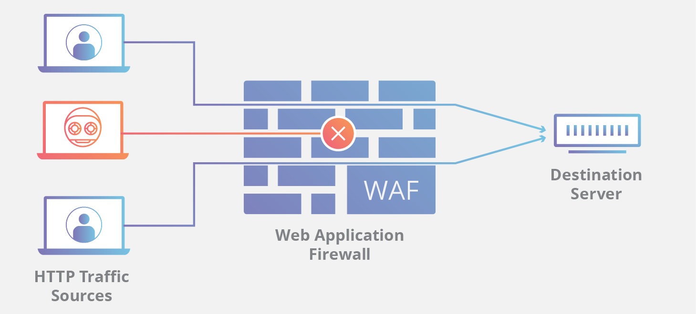

# 3.3 Nmap 详解  

Nmap （Network Mapper， 网络映射器）是一款开放源代码的**网络探测和安全审核**工具。
它被设计用決快速扫描大型网络，包括主机探测与发现、开放的端口情况、
操作系统与应用服务指纹识别、WAF识别及常见安全漏洞。它的图形化界面是Zenmap,分布式框架为DNmap。  

> [WAF](https://www.cloudflare.com/zh-cn/learning/ddos/glossary/web-application-firewall-waf/)（Web 应用程序防火墙）通过过滤和监控 Web 应用程序与互联网之间的 HTTP 流量来帮助保护 Web 应用程序。它通常可以保护 Web 应用程序，使其免受跨站点伪造、跨站点脚本 (XSS)、文件包含、SQL 注入及其他一些攻击的影响。WAF 属于协议第 7 层防御策略（OSI 模型中），并不能抵御所有类型的攻击。此攻击缓解方法通常隶属于一套工具，整套工具共同针对一系列攻击手段建立整体防御措施。  

>   

Nmap的特点如下所示。
- 主机探测：探测网络上的主机，如列出响应TCP和ICMP请求、开放特别端口的主机。
- 端口扫描：探测目标主机所开放的端口。
- 版本检测：探测目标主机的网络服务，判断其服务名称及版本号。
- 系统检测：探测目标主机的操作系统及网络设各的硬件特性。
- 支持探测脚本的编写：使用Nmap的脚本引擎(NSE)和Lua编程语言。

[官网地址及下载](https://nmap.org/)  

macos的程序和windows的界面差不多 :laughing:  

 

    </img>  

 

